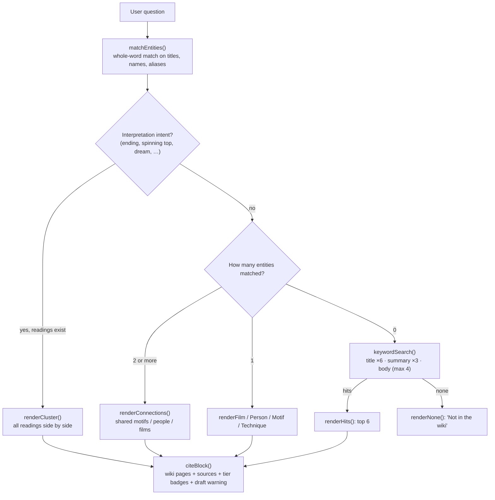

# Christopher Nolan Wiki: Chat

A small chatbot that answers questions about Christopher Nolan's films only from an embedded, cited wiki. It never answers from memory.

**Live:** https://chanman22git.github.io/nolan-wiki/

## Executive summary

- **What it is:** a chat interface over a compiled wiki of **105 linked pages**: 15 films, 70 people, 6 motifs, 9 techniques and 5 contested interpretations of Nolan's work.
- **Who it's for:** film fans who want quick answers with sources, and anyone looking at a grounded, "retrieve, don't generate" Q&A design, where every answer can be traced back to its sources.
- **Status:** a working demo. Every wiki page is marked **draft (unreviewed)**, and the bot says so in every answer.
- **Technical highlights:** a single `index.html` that runs entirely in the browser. There is no server, no build step, no API key and no language model. Answers come from deterministic retrieval (entity matching, intent rules and keyword scoring) over the embedded pages.
- **Trust by design:** each answer lists the wiki pages it used and the underlying sources, each tagged `reference`, `criticism` or `unknown`. When nothing matches, the bot says "Not in the wiki" instead of guessing.

## Features

- **Film pages:** summary, linked motifs, craft techniques, people grouped by role (director, writer, actors, composer, cinematographer, …), and any contested readings.
- **People, motif and technique pages:** summary plus the films each appears in. People with two or more films are flagged as recurring collaborators.
- **Connections:** ask about two or more entities ("How are Inception and Memento connected?") to get shared motifs, shared collaborators, films two people share, or whether a person is credited on a film.
- **Contested interpretations:** questions about endings, the spinning top, dreams or ambiguity show every recorded reading side by side, each with its stance and attribution, and none marked correct. By default this covers the *Inception* ending, and *Memento* when it is mentioned.
- **Fallback search:** if no entity matches, a keyword search returns the six closest pages with short summaries.
- **Clickable citations:** every page link in an answer asks a follow-up question about that page.
- **Suggested questions** as chips under the input.

## How it works



- **Data:** the wiki is embedded as `window.WIKI = { pages, generated, count }` in one `<script>` tag. Each page has a `slug`, `type` (`film`, `person`, `motif`, `technique` or `interpretation`), typed link fields (`people`, `films`, `motifs`, `used_in`, `recurs_in`, `film`), `summary` and `body`, plus parallel `sources` / `tiers` arrays.
- **Retrieval:** entity matching uses whole-word, case-insensitive regexes over each page's title, name and aliases (and the film title without a leading "The"). Longer matches rank higher. The keyword fallback drops stop words and tokens shorter than three characters.
- **Rendering:** all text goes through an HTML-escaping helper before light Markdown formatting (`**bold**`, `*italic*`), so no content is injected as raw HTML.

## Tech stack

- HTML, CSS and vanilla JavaScript (ES5-style IIFE)
- No dependencies, no CDN, no network calls at runtime
- GitHub Pages

## Project structure

```
nolan-wiki/
├── index.html   # UI, styles, embedded wiki data (window.WIKI) and retrieval logic
├── .nojekyll    # Serve as-is on GitHub Pages
└── README.md
```

The tooling that compiled the wiki pages is not part of this repository. Only the generated data (dated `2026-08-12` in the embedded `generated` field) is included.

## Running locally

Open `index.html` directly in a browser. It works from `file://`.

Or serve it:

```bash
git clone https://github.com/Chanman22git/nolan-wiki.git
cd nolan-wiki
python3 -m http.server 8000
# open http://localhost:8000/
```

## Deployment

GitHub Pages is configured in **"Deploy from a branch"** mode: branch `main`, folder `/` (root). The repo has no GitHub Actions workflow. Pushing to `main` republishes the site.

## Content sources and attribution

The wiki pages were compiled from five publicly available articles. Each page records which of them it draws on, and the chatbot shows them under "Underlying sources" in every answer:

| Source | Tier tag in the app | Pages citing it |
|---|---|---|
| *Every Christopher Nolan Movie Explained, From 'Inception' to 'Interstellar'* (Business Insider) | `reference` | 48 |
| *Ultimate Guide to Christopher Nolan and His Directing Techniques* (Indie Film Hustle) | `criticism` | 48 |
| *The Ultimate Guide to Christopher Nolan's Movies* | `criticism` | 37 |
| *6 Christopher Nolan Movies That Are 10/10, No Notes* | `criticism` | 36 |
| *Christopher Nolan*, Wikipedia | `unknown` | 24 |

Page content is compiled into summaries for a personal, non-commercial project. The source articles themselves (the PDFs named in the data) are **not** included in this repository. Rights in the four non-Wikipedia articles remain with their respective publishers.

### Wikipedia (CC BY-SA 4.0)

Portions of this wiki were drawn from the Wikipedia article **["Christopher Nolan"](https://en.wikipedia.org/wiki/Christopher_Nolan)** by Wikipedia contributors. They were added in commit `26a4e51` ("Ingest Wikipedia source: The Odyssey, box office, awards, bio") and cover 24 pages, including all 15 film pages, people such as Christopher Nolan and Emma Thomas, and the IMAX and celluloid technique pages.

Wikipedia text is licensed under the [Creative Commons Attribution-ShareAlike 4.0 International License (CC BY-SA 4.0)](https://creativecommons.org/licenses/by-sa/4.0/). That material has been condensed and rephrased into wiki-page summaries. As required by the licence, the Wikipedia-derived portions are shared under CC BY-SA 4.0.

## Roadmap and known limitations

- **Draft content:** all 105 pages are unreviewed. Facts, especially recent figures such as box office numbers, should be checked before being relied on.
- **Rule-based understanding:** retrieval uses regexes and keyword matching, not semantic search. Paraphrased questions that avoid page names may fall through to keyword search or to "Not in the wiki".
- **Tier labels:** the Wikipedia source is tagged `unknown` in the data. Giving it an explicit tier (for example `reference`) would make the citations clearer.
- **Rebuilding the wiki:** the compilation pipeline lives outside this repo. Updating the content currently means regenerating and re-embedding the `window.WIKI` payload.

## Author

**Chandru** ("BuiltByInstincts"), Product & Data Builder, Bengaluru. I build products at the intersection of AI, data, and human behaviour.

- Portfolio: https://chanman22git.github.io/builtbyinstincts/
- LinkedIn: https://linkedin.com/in/chandrasekarv22
